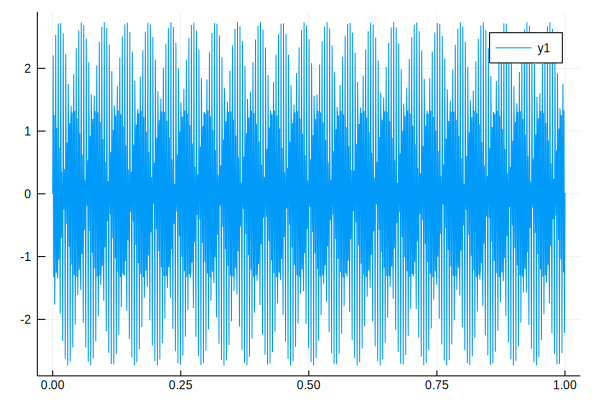
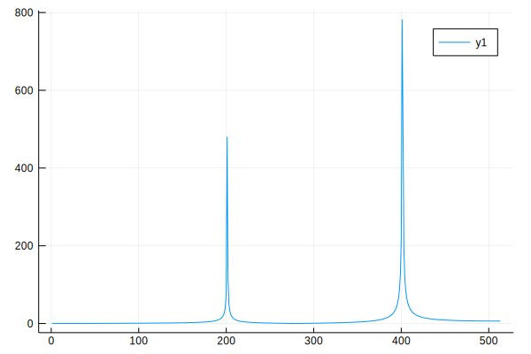
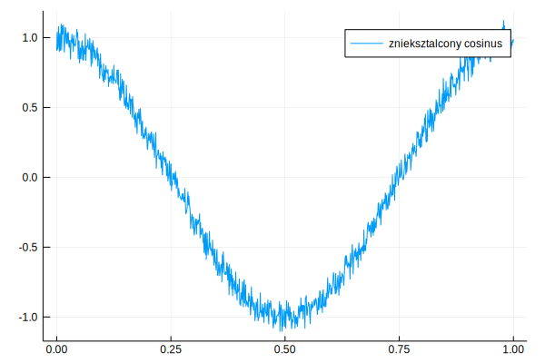
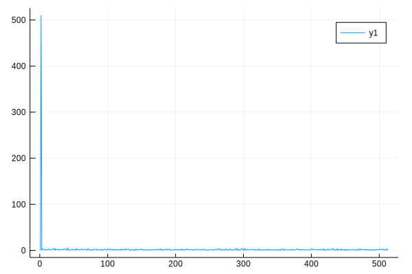
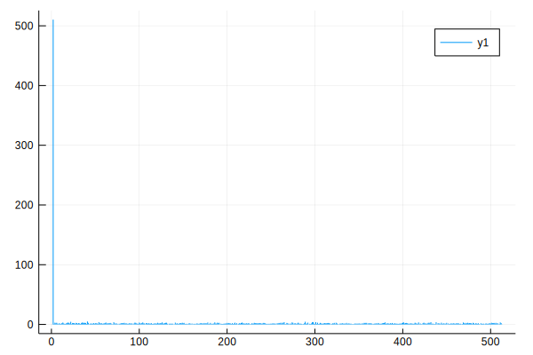
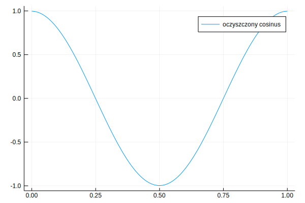

```julia
import Pkg
Pkg.add("DataFrames")
```

      Updating registry at `~/.julia/registries/General`
      Updating git-repo `https://github.com/JuliaRegistries/General.git`
    [?25h[1mFetching: [========================================>]  100.0 %.0 % Resolving package versions...
     Installed Parsers ─ v0.3.6
      Updating `~/.julia/environments/v1.1/Project.toml`
     [no changes]
      Updating `~/.julia/environments/v1.1/Manifest.toml`
      [69de0a69] ↑ Parsers v0.3.5 ⇒ v0.3.6


```julia
using Plots
using DataFrames
Pkg.add("CSV")
using CSV
```

     Resolving package versions...
      Updating `~/.julia/environments/v1.1/Project.toml`
     [no changes]
      Updating `~/.julia/environments/v1.1/Manifest.toml`
     [no changes]


    ┌ Info: Recompiling stale cache file /home/jcobb/.julia/compiled/v1.1/CSV/HHBkp.ji for CSV [336ed68f-0bac-5ca0-87d4-7b16caf5d00b]
    └ @ Base loading.jl:1184


Ładujemy pliki pierwszego zadania - przetwarzanie sumy sygnałów


```julia
os1 = CSV.read("res/original_signal_1")
ts1 = CSV.read("res/transformed_signal_1")
```


<table class="data-frame"><thead><tr><th></th><th> col1</th><th> col2</th></tr><tr><th></th><th>Int64</th><th>Float64</th></tr></thead><tbody><p>513 rows × 2 columns</p><tr><th>1</th><td>1</td><td>0.00724596</td></tr><tr><th>2</th><td>2</td><td>0.00976704</td></tr><tr><th>3</th><td>3</td><td>0.0149696</td></tr><tr><th>4</th><td>4</td><td>0.020944</td></tr><tr><th>5</th><td>5</td><td>0.0271881</td></tr><tr><th>6</th><td>6</td><td>0.0335538</td></tr><tr><th>7</th><td>7</td><td>0.0399855</td></tr><tr><th>8</th><td>8</td><td>0.0464584</td></tr><tr><th>9</th><td>9</td><td>0.05296</td></tr><tr><th>10</th><td>10</td><td>0.0594836</td></tr><tr><th>11</th><td>11</td><td>0.0660256</td></tr><tr><th>12</th><td>12</td><td>0.0725837</td></tr><tr><th>13</th><td>13</td><td>0.0791569</td></tr><tr><th>14</th><td>14</td><td>0.0857447</td></tr><tr><th>15</th><td>15</td><td>0.0923469</td></tr><tr><th>16</th><td>16</td><td>0.0989636</td></tr><tr><th>17</th><td>17</td><td>0.105595</td></tr><tr><th>18</th><td>18</td><td>0.112242</td></tr><tr><th>19</th><td>19</td><td>0.118905</td></tr><tr><th>20</th><td>20</td><td>0.125584</td></tr><tr><th>21</th><td>21</td><td>0.13228</td></tr><tr><th>22</th><td>22</td><td>0.138995</td></tr><tr><th>23</th><td>23</td><td>0.145728</td></tr><tr><th>24</th><td>24</td><td>0.15248</td></tr><tr><th>25</th><td>25</td><td>0.159253</td></tr><tr><th>26</th><td>26</td><td>0.166046</td></tr><tr><th>27</th><td>27</td><td>0.172862</td></tr><tr><th>28</th><td>28</td><td>0.179701</td></tr><tr><th>29</th><td>29</td><td>0.186563</td></tr><tr><th>30</th><td>30</td><td>0.19345</td></tr><tr><th>&vellip;</th><td>&vellip;</td><td>&vellip;</td></tr></tbody></table>


Przebieg naszego sygnału:


```julia
plot(os1[1], os1[2])
```





Sygnał poddany transformacie. Otrzymaliśmy widmo częstotliwości sygnału, pozwalające nam odczytać jakie składowe harmoniczne wchodzą w jego skład


```julia
plot(ts1[1], ts1[2])
```





Ładujemy pliki drugiego zadania - oczyszczanie "zaszumianego przebiegu funkcji cosinus"


```julia
os2= CSV.read("res/original_signal_2")
ts2 = CSV.read("res/transformed_signal_2")
rs2 = CSV.read("res/result_signal_2")
```


<table class="data-frame"><thead><tr><th></th><th> col1</th><th> col2</th></tr><tr><th></th><th>Float64</th><th>Float64</th></tr></thead><tbody><p>1,024 rows × 2 columns</p><tr><th>1</th><td>0.0</td><td>0.99679</td></tr><tr><th>2</th><td>0.000977517</td><td>0.99674</td></tr><tr><th>3</th><td>0.00195503</td><td>0.996651</td></tr><tr><th>4</th><td>0.00293255</td><td>0.996526</td></tr><tr><th>5</th><td>0.00391007</td><td>0.996362</td></tr><tr><th>6</th><td>0.00488759</td><td>0.996161</td></tr><tr><th>7</th><td>0.0058651</td><td>0.995923</td></tr><tr><th>8</th><td>0.00684262</td><td>0.995647</td></tr><tr><th>9</th><td>0.00782014</td><td>0.995334</td></tr><tr><th>10</th><td>0.00879765</td><td>0.994983</td></tr><tr><th>11</th><td>0.00977517</td><td>0.994595</td></tr><tr><th>12</th><td>0.0107527</td><td>0.994169</td></tr><tr><th>13</th><td>0.0117302</td><td>0.993706</td></tr><tr><th>14</th><td>0.0127077</td><td>0.993206</td></tr><tr><th>15</th><td>0.0136852</td><td>0.992668</td></tr><tr><th>16</th><td>0.0146628</td><td>0.992092</td></tr><tr><th>17</th><td>0.0156403</td><td>0.99148</td></tr><tr><th>18</th><td>0.0166178</td><td>0.99083</td></tr><tr><th>19</th><td>0.0175953</td><td>0.990143</td></tr><tr><th>20</th><td>0.0185728</td><td>0.989418</td></tr><tr><th>21</th><td>0.0195503</td><td>0.988656</td></tr><tr><th>22</th><td>0.0205279</td><td>0.987857</td></tr><tr><th>23</th><td>0.0215054</td><td>0.987021</td></tr><tr><th>24</th><td>0.0224829</td><td>0.986148</td></tr><tr><th>25</th><td>0.0234604</td><td>0.985237</td></tr><tr><th>26</th><td>0.0244379</td><td>0.984289</td></tr><tr><th>27</th><td>0.0254154</td><td>0.983305</td></tr><tr><th>28</th><td>0.026393</td><td>0.982283</td></tr><tr><th>29</th><td>0.0273705</td><td>0.981224</td></tr><tr><th>30</th><td>0.028348</td><td>0.980129</td></tr><tr><th>&vellip;</th><td>&vellip;</td><td>&vellip;</td></tr></tbody></table>


Wykres zaszumionej funkcji cosinus


```julia
plot(os2[1], os2[2], label="znieksztalcony cosinus")
```





Wykresy ilustrujące wygląd naszejfunkcji po transformacie


```julia
plot(ts2[1], ts2[2])
```





```julia
sticks(ts2[2])
```





w celu oczysczenia funckji zerujemy wszystkie miejsca w tranformacie które przyjmują wartość < 50

Dokonujemy odwrotnej transformaty i otrzymujemy wykres oczyszczonej funcji cosinus


```julia
plot(rs2[1], rs2[2], label = "oczyszczony cosinus")
```





Jak widać powyżej, udało się skutecznie oczyścić naszą funckję

Pomocny tutorial który mocno pomógł w użyciu FFTW: https://gist.github.com/LadaF/73eb430682ef527eea9972ceb96116c5


```julia

```
